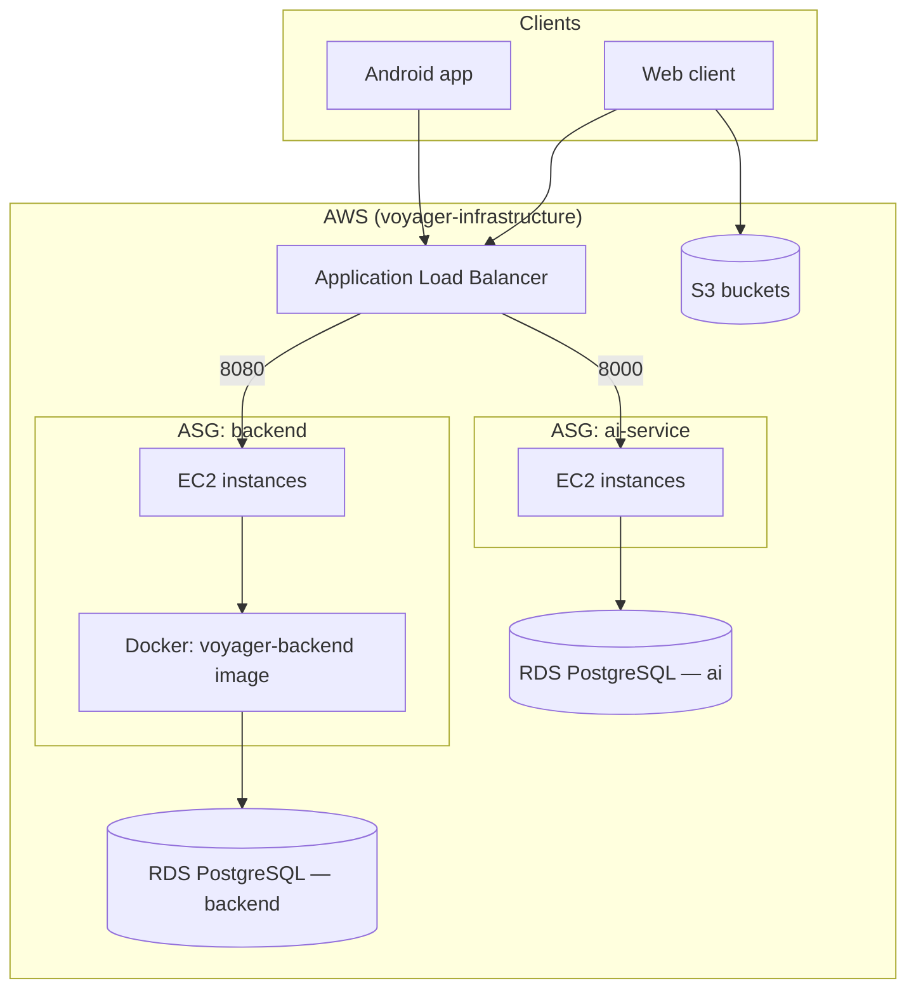

# SMARTRIP - System architecture

**Brand:** SMARTRIP

---

This document describes the **end-to-end system**: client applications, the **Spring Boot** core API in this repository, supporting repositories, and the **AWS** footprint provisioned by **voyager-infrastructure** (Academy Learner Lab–oriented shell scripts). It is the living architecture view for onboarding and operations.

**Last updated:** 2026-05-04

---

## 1. Scope and naming

| Name | Meaning |
|------|---------|
| **SMARTRIP** | Product / brand for the tourism platform |
| **voyager-backend-core** (this repo) | Core HTTP API: users, travel plans, social, matching/compatibility, activity sharing, Google OAuth; PostgreSQL persistence; Flyway migrations |
| **voyager-infrastructure** | AWS resources: VPC, security groups, RDS, EC2/ASG, ALB, S3, optional API Gateway / queues / monitoring scripts |
| **voyager-web-client** | Web frontend (separate repository) |
| **voyager-android** | Android client (separate repository) |

This `ARCHITECTURE.md` file intentionally describes the **whole platform** so agents and engineers see one consolidated picture.

---

## 2. Logical multi-repository map

```
overtheair/  (workspace root — example layout)
├── voyager-backend-core/     # Spring Boot API (this repo) + Dockerfile + CI + Postman + EC2 deploy script
├── voyager-infrastructure/   # AWS CLI/bash provisioning (config.json, setup-*.sh)
├── voyager-web-client/       # Web UI
├── voyager-android/          # Mobile app
└── overtheair-docs/          # Optional design and teaching materials
```

---

## 3. High-level runtime (AWS)

Traffic from the public Internet reaches the **Application Load Balancer (ALB)** created by `setup-compute.sh`. Listeners forward to **Auto Scaling Groups (ASG)** on EC2:

| Listener (example) | Target | Purpose |
|----------------------|--------|---------|
| HTTP **8080** | Backend ASG | Spring Boot API (`server.servlet.context-path=/api/v1`) |
| HTTP **8000** | AI ASG | Separate Python/FastAPI stack (other repository); not implemented in this Java repo |

**RDS PostgreSQL** (two instances in `config.json` by default: `smarttrip-backend-db`, `smarttrip-ai-db`) sit in private subnets with a DB subnet group. The **backend** container/JVM uses the **backend** RDS endpoint via `DB_URL` / credentials. The second database supports the AI tier when that service is deployed.

**S3** buckets (from `setup-storage.sh`) hold static site assets, media, and logs as configured in `config.json`.



---

## 4. Provisioning flow (infrastructure scripts)

Executed from **voyager-infrastructure** (see its `README.md` for details). Typical order orchestrated by `setup-infrastructure.sh`:

1. **setup-vpc.sh** — VPC, public subnets, Internet connectivity  
2. **setup-security.sh** — Security groups (backend, AI, database), IAM notes for Lab roles  
3. **setup-storage.sh** — S3 buckets for frontend / media / logs  
4. **setup-compute.sh** — Launch templates, ASGs, ALB, target groups (health checks: backend **8081** `/actuator/health` as configured there; API on **8080**)  
5. **setup-networking.sh** — API Gateway / messaging where enabled  
6. **setup-monitoring.sh** — CloudWatch log groups and alarms  
7. **setup-databases.sh** — RDS PostgreSQL instances, subnet group  

`config.json` drives names, instance sizes, AMI, keys, and database identifiers. **Secrets** should not stay in Git long-term; use Academy Lab patterns or externalize for real production.

---

## 5. Backend core (this repository)

### 5.1 Responsibilities

- REST API under **`/api/v1`**
- **JWT** authentication and **RBAC** (Spring Security)
- **JPA** entities and **Flyway** schema management against PostgreSQL
- **Google OAuth** (`/auth/google/*`)
- **CORS** configurable for Lab/ALB origins (patterns, optional allow-all)

### 5.2 Not in this repository

- **AI / ML recommendation service** — separate codebase and container image; only shown in the diagram as part of the AWS layout when deployed  
- **Infrastructure resource definitions** — live in **voyager-infrastructure**

### 5.3 Deployment artifact (Learner Lab)

**GitHub Actions** builds a **Docker image** and exports `docker save` as a tarball. On EC2, **`scripts/ec2-deploy-backend.sh`** installs Docker if needed, optionally `docker load`s the image, ensures the **RDS database** exists (empty DB + Flyway on startup), and runs **`docker run`** under **systemd** with `--env-file`, publishing **8080** and **8081**.

---

## 6. Client applications

| Channel | Repository | Typical delivery |
|---------|------------|------------------|
| Web | voyager-web-client | Static hosting (e.g. S3 website) or behind same ALB host for simpler CORS |
| Mobile | voyager-android | Play Store / sideload; talks to ALB or API URL |

Both consume the same **HTTPS/HTTP** API contract documented via **OpenAPI** (`/api/v1/api-docs`, Swagger UI).

---

## 7. Data and storage

| Store | Role |
|-------|------|
| **RDS PostgreSQL (backend)** | System of record for users, travel plans, social graph, etc. |
| **RDS PostgreSQL (ai)** | Dedicated DB for the AI microservice when deployed |
| **S3** | Frontend bundles, media, logs (per infrastructure config) |

---

## 8. Security (cross-cutting)

- **Network:** Security groups restrict database ingress to backend/AI security groups; ALB exposes only listener ports.  
- **Application:** JWT, BCrypt passwords, validated DTOs, actuator exposure tuned per profile.  
- **Transport:** TLS at the load balancer in production configurations; JDBC `sslmode` for RDS in environment files.  
- **CORS:** Application-level; see `application.yml` and `CORS_*` environment variables.

---

## 9. Observability

- **Spring Actuator** — health, metrics, info (management port **8081** in `prod` for split health checks)  
- **CloudWatch** — infrastructure scripts create log groups / alarms where enabled  
- **CI:** Trivy / SonarCloud in GitHub Actions as configured in `.github/workflows/`

---

## 10. Glossary

| Term | Definition |
|------|------------|
| **ALB** | AWS Application Load Balancer |
| **ASG** | Auto Scaling Group |
| **RDS** | Managed relational database service |
| **JWT** | JSON Web Token |
| **RBAC** | Role-based access control |
| **Flyway** | Database migration tool used at application startup |

---

## 11. Related documents

- **voyager-backend-core:** repository `README.md`
- **voyager-infrastructure:** repository `README.md` and `config.json`  

---

© SMARTRIP / Voyager Team — architecture overview for the full system.
